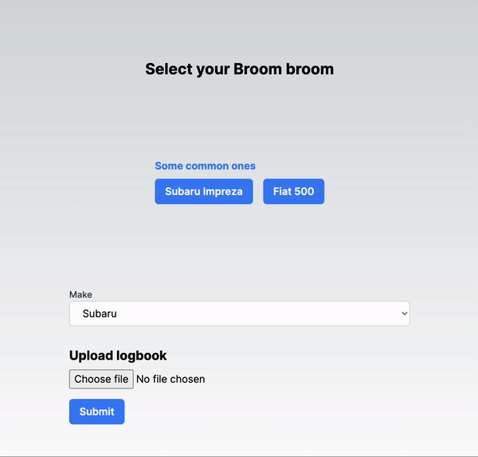

# Autograb Code Submission

Thank you for considering my code submission for the Autograb project. This README provides an overview of the submission and instructions for running the code.

## Project Overview

The code submission includes the following components:

1. **Frontend:** This folder contains the frontend code for the application. It is built using React and TypeScript and includes the necessary components and styles for the form and data display.

2. **Backend:** This folder contains the backend code for the application. It is built using Express and TypeScript and includes the necessary routes and logic for handling form submissions and serving the data.

## Instructions

To run the application, follow these steps:
1. Clone the repository:
```
gh repo clone rozajay/log-my-car
```
2. Install dependencies for the frontend and backend:
```
cd autograb/frontend
npm install

cd ../backend
npm install
```
3. Start the frontend and backend servers:
In the frontend folder
```
npm run dev
```
In the backend folder
```
npm run start
```


4. Open your web browser and navigate to `http://localhost:3000` to access the application.


## Points for Further Expansion

- **Form Validation:** Enhance the form validation logic to ensure that the submitted data meets specific criteria or follows certain patterns. Provide informative error messages to guide users in filling out the form correctly.

- **Error Handling:** Implement robust error handling mechanisms throughout the application to handle unexpected errors and display meaningful error messages to users. Consider using middleware or global error handlers for centralized error management.

- **Unit Testing:** Write unit tests using frameworks like Jest or React Testing Library to ensure the correctness of individual components, functions, and API endpoints. Aim for high test coverage to catch potential bugs or regressions.

- **Localisation and Internationalisation:** Implement localisation and internationalisation features to support multiple languages and regions. Provide language options and dynamically adapt the application content based on the user's preferences.

- **Performance Optimisation:** Identify and optimize performance bottlenecks within the application. Implement techniques like lazy loading, caching, and server-side rendering to improve page load times and overall performance.
